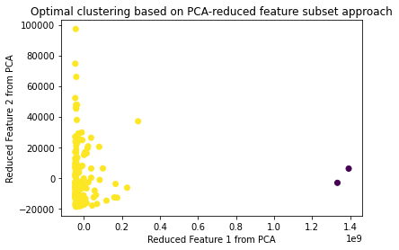
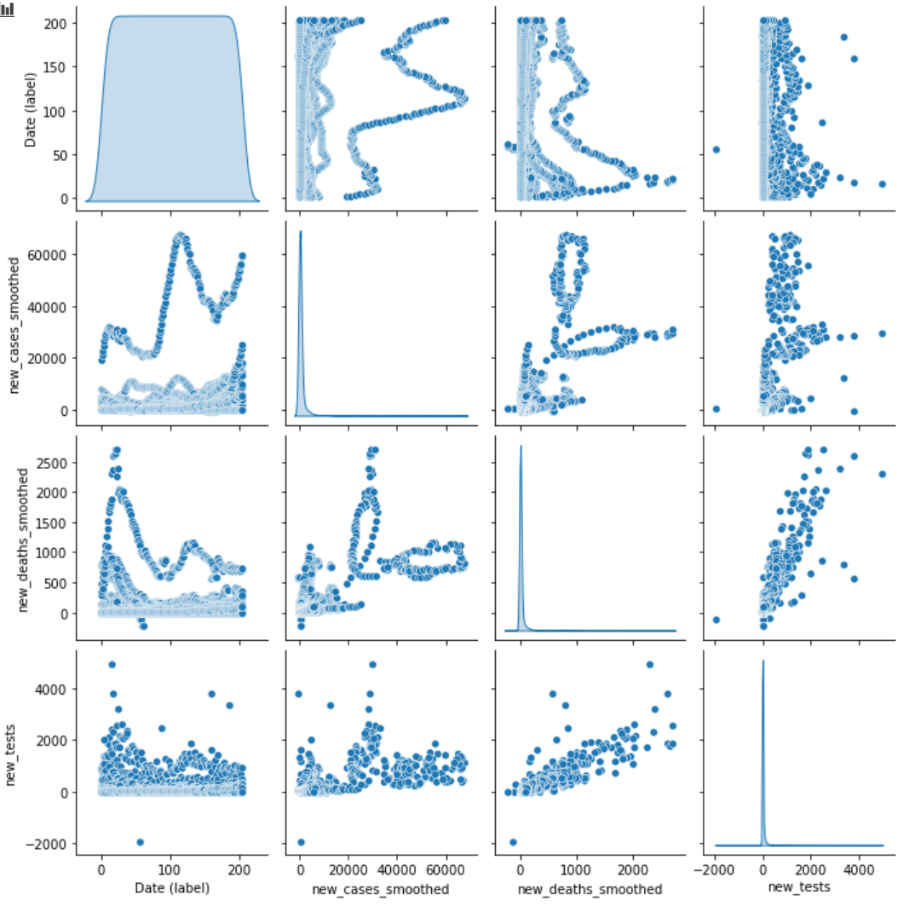
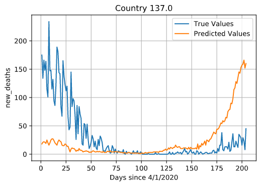

## Project Proposal
### Introduction/Background
Corona-virus disease 2019[3] is an infectious disease caused by severe acute respiratory syndrome corona-virus 2 and as of September 2020 has infected more than 31 million people worldwide. With six months past the day when the World Health Organization declared COVID-19 a pandemic and the fear of a second wave buzzing, it becomes important to analyze the effectiveness different responses to the virus in order to ensure we are making the right decisions and polices moving forward.

### Problem Definition
Given the health and lock down data[2] available regarding COVID-19, predict the total number of cases a country is to experience over the duration of the pandemic.

### Data Collection

Our data is obtained from the 'Our World in Data' dataset from Oxford's COVID-19 Government Response Tracker (available on GitHub). This dataset is a representation of the attributes of various countries that have gone through COVID-19 cases. Each country measures contains 8 total features, all of which are combined by a per-determined formula to determine the Government Stringency Index, or the severity of the COVID-19 spread in the particular country. These features are as follows: Population, Population Density, Median Age (of all individuals in country), Aged 65 or older (Number of people in the country), GDP per capita, Cardiovascular Death Rate, Diabetes Prevalence, and Human Development Index. To clean this data in an optimal manner, we performed the following pre-processing and feature-selection techniques:

Space for Data Cleaning Group to talk about their approaches. As per the directions on the website: Make sure to talk about the features and different feature selection approaches.

### Methods

#### Unsupervised Learning 

Our goal in the Unsupervised Learning process is to cluster countries based on attributes such as size, population, density, and other relevant features. This clustering is done in order to make sensible comparisons; due to the varying conditions of each country, there is not likely to be a singular prediction mechanism for the number of COVID-19 cases that countries are going to experience. Rather, due to the wildly differing situations unique to each country, it makes sense that there could exist many Supervised Learning solutions (in terms of different models, different parameters of a single model) for different sets of countries, based on their individual situations. As such, our goal is to separate the cleaned country data into different clusters via Unsupervised Learning, upon which Supervised Learning techniques will be applied for each individual cluster. 

To group similar countries together, we used the KMeans clustering technique, that has an underlying assumption of circular clustering of data. Principal Component Analysis (PCA) was also used in this algorithm to reduce the number of features for each country to produce optimal visualizations. Finally, the generated KMeans models were evaluated using common metrics and scores such as the Elbow Method and the Silhouette Coefficient. To implement most of the Unsupervised Learning process, the Python Sci-Kit Learning package was used (in conjunction with the NumPy and Pandas libraries). In addition, for all techniques, we first standardized the data using StandardScaler() to ensure that features with large numerical values did not disproportionately contribute to the clustering. 

First, we applied the KMeans algorithm in the Standard way, by considering all dataset features for every country in computing the centroids. We used the Elbow Method in this instance to determine the optimal number of clusters needed in this case. From this analysis, we concluded that using 5 clusters led to KMeans obtaining the best results. For this approach, we generated plots of the number of clusters versus inertia value (sum of squared distances of samples to their closest cluster center), as well as the corresponding cluster assignment for the best (5) cluster number (using PCA for dimensionality reduction). These visualizations are shown below:

In addition, we also decided to apply dimensionality reduction on our data, and see if the performance of the KMeans algorithm on the resulting feature-reduced subset increased. This feature reduction was performed in 2 ways. The first method we employed was simply to consider all possible subsets of all features in our data, for every data point. Since there were 8 total features, this meant choosing all combinations of 1 feature, all combinations of 2 features, all combinations of 3 features, and so on. We used the itertools package in Python to generate a combination list (in terms of feature indices) of all possible features. 

For each combination, we sliced our data to consider only these features. We then applied the KMeans algorithm on this reduced dataset, varying the number of clusters from 2 to 50. We then obtained the assignment of the final clustering, for the specific feature split and cluster number. In addition, to measure quality of the clustering in a more empirical way, we also measured the goodness of the clustering by computing the Silhouette Score of the final assignment. This process was repeated for every total number of features (1 to 8), all possible subsets within every feature number, and all possible number of clusters (2 to 50).

Finally, within each total number of features (1 to 8), we identified the feature subset that produced the clustering with the maximum silhouette score (for every cluster number from 2 to 50). We plotted these results on a graph, where the x-axis represented the number of clusters, and the y-axis represented the silhouette score. On this graph, data points were considered one of eight colors, to indicate the total number of features of the max clustering. This graph is shown below:

From the graph, it was clear that considering only 1 feature produced clusterings with the maximum silhouette score, for every number of clusters. As such, within all clusterings that were generated from 1 feature (there were only 392 such clusterings, one for each individual feature and number of clusters), we determined the feature and number of clusters that produced the clustering with the maximum silhouette score was 'Population' and 2 clusters, respectively (with a silhouette score of 0.9691749073425401). For this clustering ('Population' and 2 clusters), we obtained the corresponding clustering assignment on the entire dataset (with all features). A visualization of this assignment is shown below:

The second method that we applied was using PCA to reduce the number of features. Instead of considering all possible subsets for every feature number (1 to 8), for each feature number, we considered a single dataset that retained the maximum variance of the original data, which we accomplished via Principal Component Analysis. In this case, for every feature number (from 1 to 8), we used PCA to reduce the number of features to that feature number, and then applied the KMeans algorithm on this reduced dataset as before, varying the number of clusters from 2 to 50. We also used the Silhouette Score to evaluate the goodness of the clustering for every assignment.

We then created a similar graph as before, where we varied the number of clusters from 2 to 50 on the X-axis and the Silhouette Score (no need for max Silhouette Score, since there was only one clustering per number of features and cluster number) on the Y-axis, color-coding the data points to indicate the number of reduced features of the data. We noticed that, irrespective of the number of reduced features, the Silhouette Score of the clustering assignment remained essentially the same (up to the thousandths place), for all number of clusters. As such, there is only one color on the visualization below (due to the considerable overlap between all feature numbers):

Using NumPy functions, we then obtained the (number of reduced features, number of clusters) pair that produced the clustering with the maximum Silhouette Score. The resulting pair that was obtained was (1 reduced feature, 1 cluster), which produced a maximum Silhouette score of 0.9691749073272797). For this clustering (1 reduced feature and 2 clusters), we generated the corresponding cluster assignment on the entire dataset (with all features). A visualization of this assignment is shown below.

In conclusion, we see that, from our three feature selection approaches, considering all features (approach 1) produced a clustering assignment with 5 clusters, and performing dimensionality reduction (feature subsets and PCA, approaches 2 and 3) produced identical clustering assignments (with marginal silhouette score difference) with 2 clusters. From the visualizations, it is clear that the featured reduced clusterings are more optimal, in terms of both the maximum Silhouette Score as well as the distances of the clusters from each other. As such, based on this ideal assignment, we will partition our countries into 2 datasets and apply separate Linear Regression models to each dataset. These techniques are discussed more in the Supervised Learning Section.

#### Supervised Learning 

Our goal in the Supervised Learning process is to develop a regression model to predict new deaths from COVID-19. Our development of this model begins with a visual and statistical analysis of our feature set. By better understanding the statistical variation of each feature, and the correlation between features, we set ourselves up for a more informed understanding of the domain prior to model training. This analysis is included below:

What we are trying to predict:

We split our data by 80/20 for training and testing respectively. This yields 167 countries for training and 42 countries for testing. 

A statistical analysis of our training data:

||count|mean|std|min|25%|50%|75%|max|
|---|---|---|---|---|---|---|---|---|
|Country (label)|26762.0|1.047587e+02|5.967297e+01|1.000|54.000|1.060000e+02|1.530000e+02|2.090000e+02|
|Date (label)|26762.0|1.023138e+02|5.898397e+01|1.000|51.000|1.020000e+02|1.530000e+02|2.040000e+02|
|new_cases|26762.0|1.194505e+03|5.748082e+03|-8261.000|3.000|5.700000e+01|4.320000e+02|9.757000e+04|
|new_deaths|26762.0|3.261430e+01|1.525499e+02|-1918.000|0.000|1.000000e+00|7.000000e+00|4.928000e+03|
|new_tests|26762.0|1.420623e+04|7.878015e+04|-3743.000|0.000|4.100000e+01|4.321750e+03|1.492409e+06|
|stringency_index|26762.0|5.960808e+01|2.610358e+01|0.000|43.520|6.528000e+01|8.009000e+01|1.000000e+02|
|population|26762.0|4.708915e+07|1.625562e+08|97928.000|3280815.000|1.009927e+07|3.481387e+07|1.439324e+09|
|population_density|26762.0|2.058378e+02|6.553158e+02|1.980|35.608|8.134700e+01|1.975190e+02|7.915731e+03|
|median_age|26762.0|3.086748e+01|8.990814e+00|15.100|23.100|3.060000e+01|3.910000e+01|4.820000e+01|
|aged_65_older|26762.0|8.973122e+00|6.250375e+00|1.144|3.552|6.769000e+00|1.443100e+01|2.704900e+01|
|gdp_per_capita|26762.0|1.941902e+04|1.962766e+04|661.240|5189.972|1.325495e+04|2.771785e+04|1.169356e+05|
|cardiovascular_death_rate|26762.0|2.549043e+02|1.177259e+02|79.370|164.905|2.412190e+02|3.226880e+02|7.244170e+02|
|diabetes_prevalence|26762.0|7.741321e+00|3.851030e+00|0.990|5.180|7.110000e+00|1.008000e+01|2.202000e+01|
|human_development_index|26762.0|7.196080e-01|1.506658e-01|0.354|0.601|7.510000e-01|8.430000e-01|9.530000e-01|

Following a statistical analysis, we plot a few of the features against our training label to see if any visual correlations could be identified. As expected, new_deaths is strongly correlated to new_cases and new_tests, while other features such as stringency_index and population_density do not display as obvious of a correlation. 

Following a visual analysis of our data, each feature is normalized. Then, we trained a linear regression model and a DNN model. Our linear regression model was trained with an Adam optimizer, using a learning rate of 0.1, 100 epochs, a 20% validation split, and was evaluated using absolute mean error. Total train time took 26 seconds.

Finally, we trained a DNN with an Adam optimizer, using a learning rate of 0.001, 100 epochs, a 20% validation split, and was evaluated using absolute mean error. Total train time took 35 seconds. This model includes 6 layers, our features, 3 layers of 64 neurons, and an output layer

### Results
First off, let us examine the loss functions for each model on the training data. Notice how the validation data loss does not decrease with each epoch. This demonstrates an over fitting to the training data. Graphs depicted below:

Next we examine the mean absolute error of the testing data. Notice how the error is much smaller for our testing data than it was for our training data. This should be looked into further for the development of a more general model.

|Model|Mean absolute error [new_deaths]|
|---|---|
|linear_model|8.275075|
|dnn_model|8.240737|

Finally, let us examine the difference between predicted and real results. First this is done by graphing predicted vs real results. Both models demonstrate a direct linear relationship between predicted and real values. Next let us construct a histogram delineating the difference between real and predicted values. From this diagram it is clear the DNN has a tendency to under predict the number of deaths. Finally, allow us to visualize a few predictions of the test data in direct comparison to the real values as plotted against time.

|Linear Regression|DNN|
|---|---|
|||
|||
|||
|||
|||

### Discussion
After an observation of the predicted vs real results, it becomes quite clear that the model is thrown off by the noise in data. New deaths spike on various days depending on the country and how deaths are reported. Applying a uniform or gaussian smoothing to our dataset would serve to yield a more consistent and generalized model. 

Another point for improvement is our data currently contains a few negative values for new_cases, new_tests, and new_deaths. We are unsure what this represents within the data and thus have left these values in for now. This could be why our current model sometimes predicts people coming back to life as represented by negative deaths.

Some of our countries included never experienced a death from COVID-19. A discussion should be held to determine if these countries should be included, as they could provide insight in to a more general model, but at the same time could be lowering the accuracy for countries that do experience death from COVID-19.

As of current, all of our data begins on April 1st 2020. This decision was made to clean the data, but could be limiting our model in the prediction of a virus's lifetime. Perhaps a more generalized model would begin each country's timeline when the first case was discovered. 

### References
[1] Hale, Webster, Petherick, Phillips, and Kira (2020). Oxford COVID-19 Government Response Tracker - Last updated 28 September, 19:30 (London Time)

[2] “Owid/Covid-19-Data.” GitHub, 21 Apr. 2020, github.com/owid/covid-19-data.

[3] Roser, Max, and Hannah Ritchie. "Coronavirus Disease (COVID-19)." Our World in Data, 4 Mar. 2020, ourworldindata.org/coronavirus.
